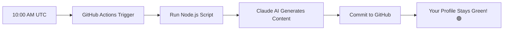

# AI Experiment System Builder🤖

> **Automated daily content generation powered by Claude AI to keep your GitHub profile active and build cool stuff!**

[](https://github.com/MRKrog/ai-daily-content/actions/workflows/daily-content.yml)
[](https://opensource.org/licenses/MIT)
[](https://nodejs.org/)

## 🎯 **What This Does**

This system automatically generates unique, themed content every day using Claude AI and commits it to your GitHub repository. Overtime, this will build a growing archive of content and build out a ai generated website. The result? **Consistent GitHub activity, growing content archive!**

## 🚀 **Quick Start**

### **Prerequisites**
- Node.js 18+
- GitHub account
- Anthropic API key

### **1. Clone and Setup**
```bash
git clone https://github.com/MRKrog/ai-experiment
cd ai-daily-content
npm install
```

### **2. Environment Configuration**
Create `.env` file:
```env
ANTHROPIC_API_KEY=your_anthropic_api_key_here
GITHUB_TOKEN=your_github_personal_access_token
GITHUB_OWNER=your-github-username
GITHUB_REPO=your-repository-name
TZ=America/New_York
```

### **3. Get API Keys**

#### **Anthropic API Key:**
1. Go to [console.anthropic.com](https://console.anthropic.com)
2. Create account → Get API key
3. Copy the key (starts with `sk-ant-...`)

#### **GitHub Personal Access Token:**
1. GitHub Settings → Developer settings → Personal access tokens
2. Generate new token (classic)
3. Select scope: `repo` (full control of repositories)
4. Copy token (starts with `ghp_...`)

### **4. Test the System**
```bash
node src/index.js
```

### **5. Add API Key to GitHub Secrets**
1. Go to your repo → Settings → Secrets and variables → Actions
2. New repository secret: `ANTHROPIC_API_KEY`
3. Paste your Anthropic API key

### **6. Manual Test via GitHub Actions**
1. Go to Actions tab
2. Click "Daily AI Content Generation"
3. Click "Run workflow"

---

## 📁 **Project Structure**

```
ai-daily-content/
├── 📄 README.md                      # This file
├── 📄 package.json                   # Node.js dependencies
├── 📄 .env                           # Environment variables (not in git)
├── 📄 .gitignore                     # Git ignore rules
│
├── 📂 src/                           # 🔧 Backend automation code
│   ├── 📄 index.js                   # 🤖 Main AI automation script
│   └── 📂 utils/                     # 🛠️ Helper functions (future)
│       ├── 📄 ai-prompts.js          # 🧠 AI prompt templates
│       ├── 📄 github-api.js          # 🐙 GitHub operations
│       └── 📄 logger.js              # 📝 Logging utilities
│
├── 📂 content/                       # 📊 AI-generated content
│   ├── 📄 latest.json                # 🔄 Current day's content
│   └── 📂 daily/                     # 📅 Daily archives
│       ├── 📄 2025-05-28.json        # Wednesday: Creative Story
│       ├── 📄 2025-05-29.json        # Thursday: Deep Thoughts
│       └── 📄 ...                    # Grows daily forever!
│
├── 📂 .github/                       # 🐙 GitHub automation
│   └── 📂 workflows/
│       └── 📄 daily-content.yml      # ⏰ Daily trigger workflow
│
├── 📂 website/                       # 🌐 Frontend (optional)
│   ├── 📄 package.json              # React dependencies
│   ├── 📂 public/                   # Static files
│   └── 📂 src/                      # React components
│       ├── 📄 App.js                # Main React app
│       └── 📂 components/           # UI components
│
├── 📂 docs/                          # 📖 Documentation
│   ├── 📄 setup-guide.md            # Detailed setup
│   ├── 📄 api-reference.md          # API docs
│   └── 📄 troubleshooting.md        # Common issues
│
└── 📂 scripts/                       # 🔧 Utility scripts
    ├── 📄 backup-content.js          # Content backup
    └── 📄 generate-stats.js          # Statistics
```

---

## ⚙️ **How It Works**

### **🔄 Daily Automation Flow**



### **📊 Content Generation Process**

1. **Scheduler Trigger**: GitHub Actions runs daily at 10:00 AM UTC
2. **AI Content Generation**: Claude creates themed content based on day of week
3. **File Creation**: New JSON file created in `content/daily/YYYY-MM-DD.json`
4. **GitHub Commit**: Automatic commit with descriptive message
5. **Activity Tracking**: Green square appears on your GitHub profile

---

## 🛠️ **Configuration Options**

### **Schedule Customization**
Edit `.github/workflows/daily-content.yml` line 8:
```yaml
# Current: 10:00 AM UTC daily
- cron: '0 10 * * *'

# Examples:
- cron: '0 9 * * *'   # 9:00 AM UTC
- cron: '30 14 * * *' # 2:30 PM UTC
- cron: '0 22 * * 1-5' # 10 PM UTC, weekdays only
```

### **Content Themes**
Modify `src/index.js` around line 25 to customize daily themes:
```javascript
const themes = {
  Monday: "your custom Monday theme",
  Tuesday: "your custom Tuesday theme",
  // ... etc
};
```

---

## 📈 **Expected Results**

### **Timeline**
- **Day 1**: Initial setup + first AI commit
- **Week 1**: 7 commits with diverse themed content
- **Month 1**: 30+ commits, established pattern
- **Year 1**: 365+ commits, rich content archive
- **Beyond**: Continuous GitHub activity showcase

### **GitHub Profile Impact**
- ✅ **Daily green squares** in activity graph
- ✅ **Consistent commit streak** 
- ✅ **Growing repository** with interesting content
- ✅ **Active developer appearance**
- ✅ **Conversation starter** ("My AI builds things for me daily!")

---

## 🚀 **Optional Enhancements**

### **🌐 Add a Website** 
Display your AI-generated content on a live website:
- React frontend showing daily content
- Browse historical content
- Day-of-week themes and styling
- Deployment to GitHub Pages

### **🎨 Enhanced Content Types**
- Code snippets and algorithms
- Technical tutorials
- Industry news summaries
- Programming challenges
- AI-generated images (DALL-E integration)

### **📊 Analytics Dashboard**
- Content generation statistics
- Most popular themes
- Commit frequency analysis
- Performance metrics

---

## 🧪 **Testing**

### **Manual Test**
```bash
# Run one-time generation
node src/index.js

# Should create content/YYYY-MM-DD.json and commit to GitHub
```

### **GitHub Actions Test**
1. Go to Actions tab in your repo
2. Click "Daily AI Content Generation"
3. Click "Run workflow" → "Run workflow"
4. Watch the automation run in real-time

---

## 🔧 **Troubleshooting**

### **Common Issues**

#### **"AI generation failed: 404 model not found"**
- Update model name in `src/index.js` to latest version
- Check Anthropic API key is correct

#### **"GitHub commit failed: 401 Unauthorized"**
- Verify GitHub token has `repo` permissions
- Check token hasn't expired

#### **"Workflow doesn't run daily"**
- Ensure repo is active (GitHub may pause workflows on inactive repos)
- Check GitHub Actions quotas

#### **"No content generated"**
- Check GitHub Secrets has `ANTHROPIC_API_KEY`
- Verify environment variables in workflow

### **Debugging**
```bash
# Check environment variables
node -e "console.log(process.env.ANTHROPIC_API_KEY ? 'API key found' : 'API key missing')"

# Test GitHub connection
node -e "const { Octokit } = require('@octokit/rest'); const o = new Octokit({auth: process.env.GITHUB_TOKEN}); o.rest.users.getAuthenticated().then(r => console.log('GitHub OK:', r.data.login)).catch(console.error)"
```

---

## 📚 **API Reference**

### **Main Functions**

#### **`generateContent()`**
Generates AI content based on current day theme.
- **Returns**: `{content, date, dayOfWeek, timestamp}`
- **Throws**: Error if AI generation fails

#### **`commitToGitHub(contentData)`**
Commits content to GitHub repository.
- **Parameters**: Content object from generateContent()
- **Returns**: Boolean success status

#### **`run()`**
Main execution function combining generation and commit.
- **Returns**: Success/failure status with details

---

## 🤝 **Contributing**

### **Adding New Features**
1. Fork the repository
2. Create feature branch: `git checkout -b feature/amazing-feature`
3. Commit changes: `git commit -m 'Add amazing feature'`
4. Push to branch: `git push origin feature/amazing-feature`
5. Open Pull Request

### **Content Theme Ideas**
- **Motivation Monday**: Inspirational quotes
- **Tutorial Tuesday**: Mini coding lessons
- **Wisdom Wednesday**: Programming wisdom
- **Throwback Thursday**: Tech history facts
- **Fun Friday**: Coding humor and memes
- **Solution Saturday**: Problem-solving tips
- **Sunday Summary**: Week reflection

---

## 📄 **License**

This project is licensed under the MIT License - see the [LICENSE](LICENSE) file for details.

---

## 🙏 **Acknowledgments**

- **Anthropic** for Claude AI API
- **GitHub Actions** for free automation
- **Open Source Community** for inspiration and tools

---

## 📞 **Support**

- **Issues**: [GitHub Issues](https://github.com/MRKrog/ai-daily-content/issues)
- **Discussions**: [GitHub Discussions](https://github.com/MRKrog/ai-daily-content/discussions)
- **Documentation**: Check the `docs/` folder for detailed guides

---

## 🎉 **Success Metrics**

After setup, you should see:
- ✅ Daily commits appearing in your GitHub repo
- ✅ Green squares in your GitHub activity graph
- ✅ Growing archive of AI-generated content
- ✅ Zero manual maintenance required

**Congratulations! You now have a fully automated AI-powered GitHub activity system!** 🚀

---

*Built with ❤️ and 🤖 by AI automation. Last updated: May 28, 2025*