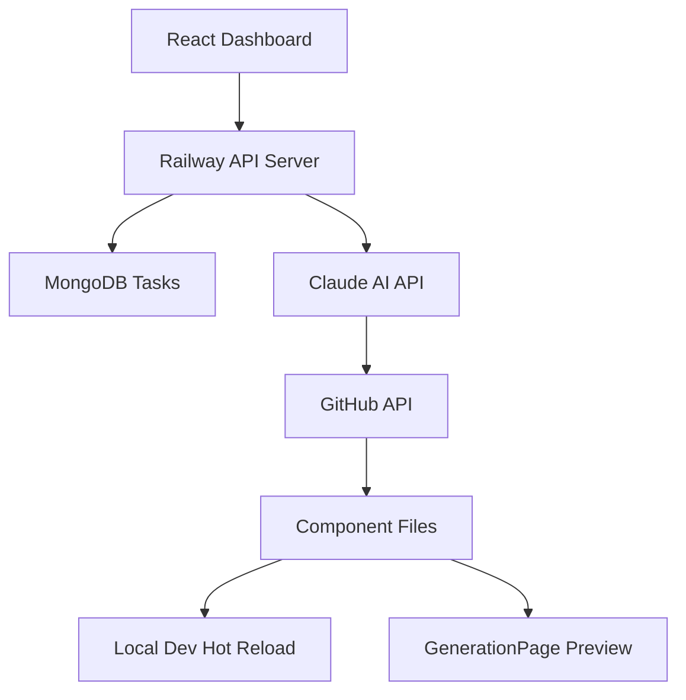
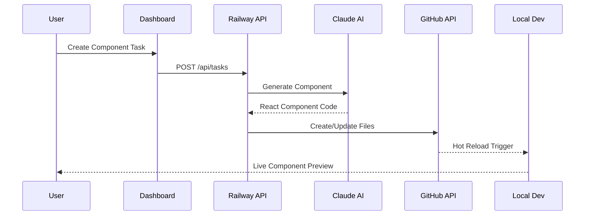

# AI Component Generation System 🤖⚛️

> **Automated React component generation powered by Claude AI with live deployment to GitHub and real-time preview system!**

[](https://github.com/MRKrog/ai-experiment)
[](https://opensource.org/licenses/MIT)
[](https://railway.app)
[](https://nodejs.org/)

## 🎯 **What This System Does**

This is a **complete AI-powered component generation pipeline** that:

- 🎨 **Generates custom React components** using Claude AI based on your prompts
- 🚀 **Auto-deploys components** directly to your GitHub repository via API
- 📱 **Live dashboard** for creating and managing component generation tasks
- 🔄 **Real-time preview** of generated components in a React app
- 🌐 **Production deployment** on Railway with MongoDB persistence
- ⚡ **Hot reload integration** - components appear instantly in your local dev environment

## 🏗️ **System Architecture**



## 🚀 **Live Demo**

- **Dashboard**: [Your Railway App URL] - Create and manage component generation tasks
- **GitHub Repo**: [ai-experiment](https://github.com/MRKrog/ai-experiment) - See auto-generated components
- **Local Preview**: `http://localhost:3000/generation` - Live component gallery

## 📁 **Project Structure**

```
ai-experiment/
├── 📱 ai-experiment-site/              # React Frontend
│   ├── src/
│   │   ├── components/
│   │   │   └── generated/              # 🤖 Auto-generated components
│   │   │       ├── index.ts            # Auto-managed exports
│   │   │       └── *.tsx               # AI-generated components
│   │   ├── pages/
│   │   │   ├── Dashboard.tsx           # Task management
│   │   │   └── GenerationPage.jsx     # Component gallery
│   │   └── services/
│   │       └── taskService.ts          # API integration
│   
├── 🗄️ mongodb/                         # Backend API
│   ├── src/
│   │   ├── models/
│   │   │   └── Task.js                 # Task data model
│   │   ├── routes/
│   │   │   └── taskRoutes.js           # API endpoints
│   │   ├── services/
│   │   │   ├── claudeService.js        # AI integration
│   │   │   ├── githubApiService.js     # GitHub deployment
│   │   │   └── fileSystemService.js    # Local deployment
│   │   └── server.js                   # Express server
│   
├── 📂 content/                          # Generated content archive
└── 📋 README.md                        # This file
```

## ⚙️ **How It Works**

### 🔄 **Complete Generation Pipeline**

1. **Task Creation**: User creates component request via React dashboard
2. **AI Generation**: Claude AI generates custom React component based on prompt
3. **Code Extraction**: System extracts clean TypeScript code from AI response
4. **GitHub Deployment**: Component automatically deployed to repository via GitHub API
5. **Auto-Injection**: Component imported and rendered in GenerationPage
6. **Live Preview**: Component appears instantly in local development environment

### 📊 **Component Generation Process**



## 🛠️ **Installation & Setup**

### **Prerequisites**
- Node.js 18+
- MongoDB
- GitHub Personal Access Token
- Anthropic API Key
- Railway Account (for production)

### **1. Clone Repository**
```bash
git clone https://github.com/MRKrog/ai-experiment
cd ai-experiment
```

### **2. Backend Setup**
```bash
cd mongodb
npm install
cp .env.example .env
```

**Configure `.env**:**
```env
# MongoDB
MONGODB_URI=mongodb://localhost:27017/ai-tasks

# Claude AI
ANTHROPIC_API_KEY=your_claude_api_key

# GitHub API Integration
GITHUB_TOKEN=ghp_your_personal_access_token
GITHUB_USERNAME=YourUsername
GITHUB_REPO=ai-experiment

# Local Development
ENABLE_AUTO_DEPLOYMENT=true
ENABLE_PRODUCTION_DEPLOY=false
REACT_PROJECT_PATH=../ai-experiment-site
```

### **3. Frontend Setup**
```bash
cd ../ai-experiment-site
npm install
```

### **4. Start Development**
```bash
# Terminal 1: Backend
cd mongodb && npm run dev

# Terminal 2: Frontend  
cd ai-experiment-site && npm run dev
```

### **5. Production Deployment**

**Railway Configuration:**
```env
# Production Environment Variables
MONGODB_URI=your_production_mongodb_uri
ANTHROPIC_API_KEY=your_claude_api_key
GITHUB_TOKEN=ghp_your_token
GITHUB_USERNAME=YourUsername
GITHUB_REPO=ai-experiment
ENABLE_AUTO_DEPLOYMENT=false
ENABLE_PRODUCTION_DEPLOY=true
NODE_ENV=production
```

## 🎨 **Features**

### 🤖 **AI Component Generation**
- **Claude AI Integration**: Generates custom React components based on natural language prompts
- **Smart Code Extraction**: Parses AI responses to extract clean TypeScript code
- **Multiple Component Types**: Headers, buttons, cards, dropdowns, modals, etc.
- **Tailwind CSS Styling**: Generated components use modern utility classes

### 🚀 **Auto-Deployment System**
- **GitHub API Integration**: Creates files directly in your repository
- **Dual Mode**: Local file system for development, GitHub API for production
- **Auto-Exports Management**: Automatically updates index.ts with new exports
- **Component Injection**: Auto-injects components into GenerationPage for preview

### 📱 **Dashboard & UI**
- **Task Management**: Create, track, and manage component generation tasks
- **Real-time Status**: See generation progress and deployment status
- **Component Gallery**: Preview all generated components with live demos
- **Dark Theme**: Modern, responsive UI with dark mode design

### 🔄 **Development Experience**
- **Hot Reload Integration**: Components appear instantly in local development
- **Type Safety**: Full TypeScript support with proper interfaces
- **Component Library**: Build up a library of AI-generated components
- **Version Control**: All changes tracked in git with automated commits

## 🧪 **Usage Examples**

### **Creating Components**

1. **Simple Button**:
   ```
   Prompt: "Create a blue gradient button with hover effects"
   Result: Fully functional ButtonComponent with animations
   ```

2. **Interactive Dropdown**:
   ```
   Prompt: "Build a dropdown menu with search functionality"
   Result: Searchable dropdown with keyboard navigation
   ```

3. **Data Card**:
   ```
   Prompt: "Create a card component for displaying user profiles"
   Result: ProfileCard with image, name, and action buttons
   ```

### **API Endpoints**

```javascript
// Create new task
POST /api/tasks
{
  "title": "Create Header Component",
  "description": "Modern navigation header",
  "prompt": "Build a responsive header with logo and navigation",
  "type": "code_generation",
  "createdBy": "user123"
}

// Process task (triggers AI generation)
POST /api/tasks/:id/process

// Get all tasks
GET /api/tasks

// Get task by ID
GET /api/tasks/:id
```

## 📈 **Generated Components**

All AI-generated components include:
- ✅ **TypeScript interfaces** for props
- ✅ **Tailwind CSS styling** for responsive design  
- ✅ **React best practices** (functional components, hooks)
- ✅ **Accessibility features** where applicable
- ✅ **Clean, readable code** with proper exports

### **Example Generated Component**
```typescript
import React, { useState } from 'react';

interface DropdownProps {
  title: string;
  children: React.ReactNode;
}

const Dropdown: React.FC<DropdownProps> = ({ title, children }) => {
  const [isOpen, setIsOpen] = useState(false);
  
  return (
    <div className="relative">
      <button 
        className="bg-blue-500 hover:bg-blue-600 text-white px-4 py-2 rounded"
        onClick={() => setIsOpen(!isOpen)}
      >
        {title}
      </button>
      {isOpen && (
        <div className="absolute z-10 mt-2 bg-white shadow-lg rounded">
          {children}
        </div>
      )}
    </div>
  );
};

export default Dropdown;
```

## 🔧 **Configuration**

### **Deployment Modes**

**Local Development:**
```env
ENABLE_AUTO_DEPLOYMENT=true      # Write files locally
ENABLE_PRODUCTION_DEPLOY=false   # Don't use GitHub API
REACT_PROJECT_PATH=../ai-experiment-site
```

**Production (Railway):**
```env
ENABLE_AUTO_DEPLOYMENT=false     # Don't write local files
ENABLE_PRODUCTION_DEPLOY=true    # Use GitHub API
```

### **Component Types**
Modify task types in `mongodb/src/models/Task.js`:
```javascript
type: {
  type: String,
  enum: ['image_generation', 'code_generation', 'text_generation'],
  required: true
}
```

## 🚀 **Advanced Features**

### **GitHub API Integration**
- Creates files directly in your repository from production
- Handles naming conflicts automatically
- Updates exports and imports
- Manages commit messages and git history

### **MongoDB Task Management**
- Persistent task storage with metadata
- Status tracking (pending → in_progress → completed/failed)
- Token usage tracking for AI calls
- Deployment information storage

### **Railway Production Deployment**
- Automatic deployments on git push
- Environment variable management
- MongoDB Atlas integration
- Health check monitoring

## 🔍 **Monitoring & Debugging**

### **Task Status Tracking**
- **pending**: Task created, waiting for processing
- **in_progress**: AI generation in progress
- **completed**: Component generated and deployed
- **failed**: Error occurred during generation

### **Deployment Information**
Each task tracks:
- Generated filename and content
- Deployment method (local/GitHub API)
- Token usage and costs
- Timestamps for all stages
- Error messages if failed

### **Console Logging**
```bash
🎯 Processing single task: 1234567890
🔧 Deployment mode: GitHub API
🤖 Generating component with Claude API...
🚀 Starting GitHub deployment pipeline...
✅ GitHub deployment completed for HeaderComponent.tsx
```

## 🤝 **Contributing**

1. Fork the repository
2. Create feature branch: `git checkout -b feature/amazing-feature`
3. Commit changes: `git commit -m 'Add amazing feature'`
4. Push to branch: `git push origin feature/amazing-feature`
5. Open Pull Request

## 📄 **License**

This project is licensed under the MIT License - see the [LICENSE](LICENSE) file for details.

## 🙏 **Acknowledgments**

- **Anthropic Claude AI** for intelligent component generation
- **GitHub API** for seamless repository integration
- **Railway** for reliable production hosting
- **MongoDB** for robust data persistence
- **React & TypeScript** for modern frontend development

---

## 🎉 **What You Get**

After setup, you'll have:
- ✅ **AI-powered component generator** with natural language prompts
- ✅ **Automated deployment pipeline** from AI to production
- ✅ **Live component gallery** with instant previews
- ✅ **Professional React components** with TypeScript and Tailwind
- ✅ **Zero manual deployment** - everything happens automatically
- ✅ **Growing component library** built by AI

**You now have a complete AI-powered React component factory!** 🏭🤖

---

*Built with ❤️, 🤖 AI, and ⚛️ React. Deployed on 🚀 Railway.*